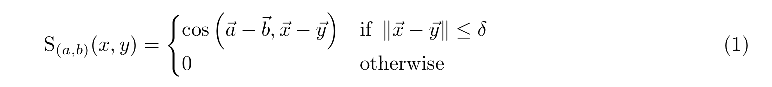

# Man is to Computer Programmer as Woman is to Homeworker? Debiasing Word Embeddings

論文要約しましょう。

---

## Summary

学習済みの機械学習モデル（Word2Vec）に含まれるバイアス成分を捉えて削減する手法の提案。

→ abstractをまとめる。

---

## 3.Preliminary

- 使用しているembeddingについての説明
  - one-hot vectorを入れる。
  - gender neutoral wordsの定義
    - 性差別に関連する単語の辞書（flight attendant, shoesなど）
  - she-heのペアのデータを作って、これを評価する。
    - 作り方は7章参照
- 類似する単語を拾ってくるのに、cos類似度を使用。

### Embedding

- w2vNEWS embedding（https://code.google.com/archive/p/word2vec/）
- d=300
- mikrovさんの2013年の論文。(あとで確認する。)
- pre-trainingにgoogle news corpus（normalizeもしてるよ）
  - 50,000語以上から、フィルターで取り除いて、26,377語残す
  - 以下の条件は取り除く
    - 出現回数が20回より下。
    - upper-case
    - 数字
    - 句読点
- 一般性は失ってないぜ。（gender stereotypes are also present in other embedding data-sets）

### Crowd Experiments

- 一般人による評価をする。
  - クラウドソーシングで、一般の人（アメリカ人）に依頼。
  - Amazon Mechanical Turk
- 2typeの実験（なぜそのタスクで評価すると論文の主張が正当化させるのか？論文の主張がなにか？）
  - 単語の評価。embeddingに偏見の単語が含まれているかどうか。 
  - 類推した単語の評価。
  - これらから、ratingから性能をみる。情報集約して、precisionとrecallで評価。
- 10人で多数決。半分以上でアノテーション。

あとは、文化や人種も考慮して、不快に思わないバイアスを用意している。

## 4.Gender stereotypes in word embeddings

仮説

- w2vにあるバイアスを理解する
- 人の意見と数値バイアスがどれくらい近いのかを調べる

２つの方法で評価できる。

- embeddingが持つ、occupation wordsの偏見を評価する。
- embeddingが出したアナロジーに対して人が偏見かどうか判断する。

探索的な分析をして次のmetricsのモチベーションにつなげる

Figure.1 Glove使ったときのshe-heのペア一覧。 
Figure.2 類推で出て来る結果と、debiasingした結果 
Figure.3 間接バイアスの例 
Figure.4 どのembeddingでも同じような傾向が出る。 

### Occupational stereotype

職業のstereotypeについて、定義とその説明を行う。

Occupational stereotypeを決めに行く話。

男性と女性でword2vecで近しい職業をリスト化したものを使う。

- そのリストをcrowdworkerに男性よりか、女性よりか、それともニュートラルか評価してもらう。
- 10人のcrowdworkerによってgender stereotypeを評価する。
  - 評価について、0-10の幅でレートを付ける。
  - 男女軸で職業ワードを見積もると、Spearman係数0.5で、強い相関が見られた。
    - このことから、w2vの幾何学的バイアスは、一般群衆のgender stereotypeも調整されているといえる。
    - そこで、相関があるこの職業単語を使うことにする、なぜなら人が簡単に解釈できて、共通のgender stereotypeを捉えることができるから。
- また、stereotypeではない他の単語もタスクでつかう。
  - 気づいてほしいのは、たとえば womanとmanのような性別のペアが使用できる。
  - sheとheを選んだのは、よく出て来る単語で、語義（単語の意味）の変化があまりないから選んだ。manとwomanも同じ理由で使うことができる。

職業ごとの上のshe-heの向きを、Word2VecのembeddingとGloVeのembeddingで見積もってみた。結果、高い相関が見られたので、embeddingが変わっても偏見を持つし、古典的なコーパス訓練やword2vecに限った話ではないといえる。

Glove

- J. Pennington, R. Socher, and C. D. Manning. Glove: Global vectors for word representation. In EMNLP, 2014.

### Analogies exhibiting stereotypes

- 類推は、word embeddingの質とその偏見の評価をするのに役立つ。
- embeddingで類推を生成する方法と、その類推を使って偏見の規模を測る方法について話す。　（細かな話は appendinx Aを参照）
- 単語のペアを１組与えて、そのペアと対応する単語セットを生成してもらう。
  - 例えば、he-sheが与えられたら、heに対応する単語xとsheに対応する単語yを生成して評価する。
  - 一般的に、例えば、he-sheとking-(?)が与えられたとき、(?)の単語を推定してもらう仕組みがあるが、ここでは上記の例のように修正した。
- もととなる単語のペア（a, b）と生成された単語のペア（x, y）があるとき、以下の以下の計算式でスコアリングする。
  - コサイン類似度

- δ : 類似度の閾値（２つの単語の距離の閾値）
- 直感的なスコアリングの指標として、２つのペア同士の向きを近さを見る。
  - 意味的に明確にするために、２つの単語が離れすぎないようにする。
- 閾値 δ について
  - 全実験で、δ=1をよく使った。
  - 全embeddingが正規化されると、閾値は angle<=π/3 に相当する。これはオリジナルのペアよりも近いと意味する。
  - 実際にランダムな2つのembeddingのベクトルよりも、類推で構成された単語ペアのほうが著しく近似しているといえる。
- embeddingと種となる単語が与えられたとき、トップスコアの類推ペアを出力する。
  - 同じ単語が出た場合、余分なものとして削除する。

類推の判定結果について

- stereotypeやbiasは文化から大きく影響される。
  - 今回の実験で雇ったUSのcrowdworkerの類推の評価に基づくと。
- 各類推について、2つのyes/no questionを出題した。
  - 出力された単語のペアが直感的かどうか？
  - gender stereotypeを反映しているか？
- 各類推の判定は１０人のcrowdworkerが行う。
  - 判定の人数がそのままrateとして反映する。
- 全体的に、150の類推のうち72のペアが、性別的にふさわしいと判定された。(5人以上の評価がある。)
  - 図（リスト）の説明
    - 生成された偏見性が見られる類推の評価を Figure.2のトップに
    - 直感的に作成した性別的にふさわしい類推の評価を Figure.2の下部に置く。
    - リスト全体の類推とレーティングについては、Appendix Gで詳しく紹介。

### Indirect gender bias

- 直接的なbiasを分析すると、性別の特性を持つ単語とgender neutral wordで類似性がはっきりと現れる。
- gender biasも gender neutral words との間で幾何学的にも影響がある。
- indirect gender biasのテストについて
  - gender neutral wordsでペアを作る。（例えば、softballとfootball）
  - 全職業ワードをgender neutral wordsで作成したペアの向きに反映させる。
  - 反映させたワードから、近しい単語を見つける。（Fig.3参照）

例

- bookkeeperとreceptionistは、footballよりもsoftballに近しい。
- 近しいことから、間接的に bookkeeper, receptionist, softballは女性から連想される。
  - ここで大切なことは、多くのペア（男性的or女性的偏見を含む）は論理的に性を連想させるような処理はしていないことに注目してほしい。
  - たとえば、footballとfootballerは男性のバイアスが強いが、生徒は別の要因で類似性を正当化する。(section5で、計測方法とgender biasへの間接的な効果について詳しく説明する。)

## Geometry of Gender and Bias
