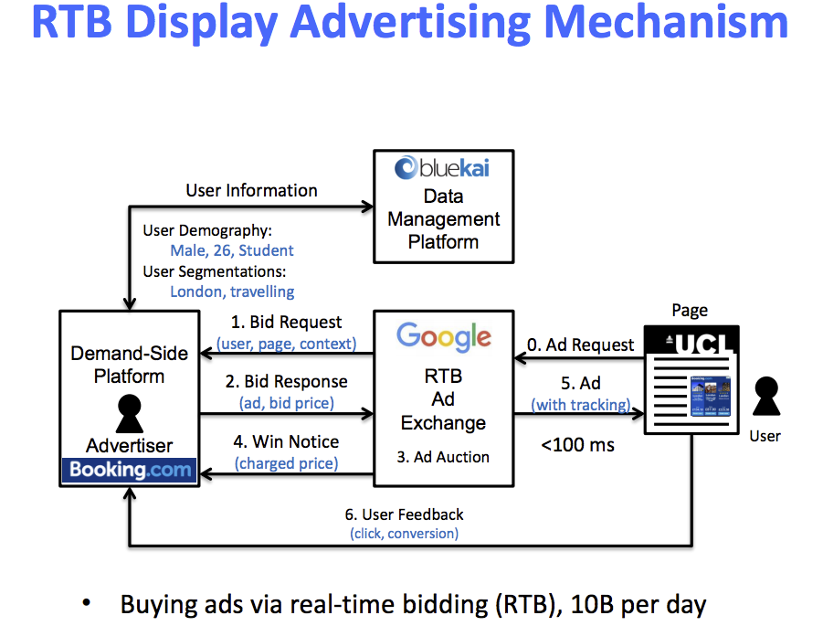

# Learning, Prediction and Optimisation in RTB Display Advertising

ADテクのチュートリアル 
上海交通大学の先生がまとめたもの。

## 資料

---

元スライドと参考資料

- http://wnzhang.net/slides/cikm-16-rtb-full.pdf
- https://arxiv.org/pdf/1610.03013.pdf
  - 教科書

## 目次

---

- RTB system
- Auction mechanisms
- User response estimation
  - CTR推定についてはここにかかれている。
- Learning to bid
- Conversion attribution
- Pacing control
- Targeting and audience expansion
- reverse price optimization

## Real-Time Bidding(RTB) system

---

広告の説明とRTB systemの紹介。
広告は経済的制約のなかで企業とユーザーをベストマッチさせるもの。 
従来の広告は無駄が多い（町の看板など）。 
インターネットユーザーと広告主をベストマッチさせるアルゴリズムの設計する。

仕組みの例：

### Sponsored Search

- Google検索などで出てくる広告
- 広告主はキーワードごとに課金する。
- ユーザーがキーワードを検索したとき、adランキングのオークションを開催する。
- リスティング広告

### Display Advertising

- ユーザーの情報に対して課金する
- ユーザーと広告を仲介する仕組み。

### Internet Advertising Frontier (RTB based Display Avertising)

RTBとは

- オンラインで広告が閲覧されるたびに、評価・売買がそれぞれ＆即座に実施される。
- キーワードの購入や広告を束ねる代わりに、広告主が直接ユーザーを買う仕組みのこと。
- 閲覧したサイト情報を元に、別のサイトへ広告を掲載される。
  - 例えば、ロンドンのホテルのサイトを見た後に、facebookに行くとロンドンのホテル関連の広告が表示される。
- 個人レベルでリアルタイムに広告の売買と反映が行われる。

システムのフロー

## Auction mechanisms

---

オークションの仕組み

- オークションの仕組み
  - 表示枠に対して掲載する広告を決めるための仕組みを説明。
    - 価格とprivate valueの掛け合わせで評価する。（GoogleAdWordsは、private valueにSQが設定されている。）
  - どうやって釣り合いを保つか。掛け金を最適化するか。ランキングをどのように決めるか？

## User Response Estimation

---

CTR推定の話。 
CTR予測で使用するアルゴリズムの説明が中心になっている。

User response推定の問題を列挙 
例えば、clickした（１）かしていない（0）を知りたいが、CTR推定は 0.15で返ってくる。

- どうやって求めるの？

求めるためにデータを数値表現にする。カテゴリデータに対しては、one-hot encodingで対応できる。 
しかし、高次元でsparseな特徴ができる。

以下の条件のときに機械学習によるCTR推定をやると有効。

- ２つの特徴空間が大きい。(>10 millions)
  - Bloom filter を使えば新しい特徴が検知可能。 (5>instances)
- データの発生数が多い。（>10 millons daily）
- クリックされた/されないのラベルがアンバランスであるとき。
  - 殆どの場合、click / non-click = 0.3%ぐらい
  - negative down samplingを実施して、トレーニング時にデータの偏りをなくす。
  - calibration
    - ラベルの推定を確率の推定にマッピングする。

### 線形モデル

線形モデルで紹介するものは以下の通り。

- Logistic Regression
  - with SGD learning
  - Sparse splution（Logistic Regression with FTRL）
- Online Bayesian Probit Regression

### 線形モデルの良し悪し

- 良い
  - 効果的＆拡張できる
  - 大きな特徴やデータを調査できる
- 悪い
  - 上位の組み合わせの特徴を定義しない限り、特徴の相互作用を捉えることができない。
  - モデルに限界がある。（特徴が独立した仮説になっている。）

### 非線形モデル

以下の非線形モデルを紹介する。

- Factorisaztion Machines
  - Field-aware Factorisation Machines
- Gradient Boosting Decision Trees
- Combined Models
  - GBDT+LR
  - GBDT+FM
  - Factorization Machine + Neural Network
- Deep Neural Network
  - Product-based Neural Networks (PNN)
  - Convolutional Click Prediction Model

実験結果を見ると、PNNのパフォーマンスが良い。

表示に偏りがある場合の対応方法として Unbias Learning という手法が紹介されている。広告に偏りが出ないように、公平性を保つ手法。

## Learning to bid

---

入札を学習するための方法を紹介。（ざっくりと仕組みを理解するため、細かくメモしていない。後半雑）

AdWordsの資料と合わせて読むとわかりやすい。

- https://support.google.com/adwords/answer/2472725?hl=ja

入札のデータとその特徴の例は以下の通り。

- bid request features
  - 高次元でスパースな２値ベクトル。（場所, 画像サイズ, 地域・国, インデックス・page番号）
- bid
  - 数値（real or integer）
- win
  - bool
- cost
  - 数値（real or integer）
- feedback
  - ２値

入札学習の定義するときの課題

- 入札リクエストごとの価格をいくらにするのか？
  - 最適な入札価格を探す。
- 予算制限がある中で目標値に最適化して入札する。

実際の入札戦略の仕組み

Quantitative Perspective 
定量的（数値的）予測

入札価格は、**Utility Estimation（CTR, CVR, Revenue）** と **Cost Estimation（Bid landscape）** を使って計算する。

- bid landscapes
  - 入札単価状況
  - https://developers.google.com/adwords/api/docs/guides/bid-landscapes?hl=ja

CTRとはUser responseで話したので、ここからは cost estimation の話をする。

特徴はユーザー情報を使用する。(Survival Tree Modelを参照) 
紹介されているアルゴリズムは以下の通り。

- Linear Regression で価格推定
- Survive Tree Models

また、2番目の価格の推定も紹介している。

Bidding Strategiesの真実

第二価格のオークションで正しく入札するには

- impの正しい値で入札する
- imp true valueには、クリックされたときの価格を入れる（クリックされてないときは 0を入れる。）
- averated imp value には、click * CTR を入れる。
- biddingの真実を言うと、以下の式を使用する。
  - bid = r_conv * CVR
  - bid = r_click * CTR

上記の式についての良し悪しとして、

- 良し
  - 理論上正当性といえる。
  - 簡単に実装できる（広く使われている。）
- 悪し
  - 幾つかの制限を考慮していない（キャンペーン予算やオークションのボリューム）

biddingは線形的ではないので、以下のような対応を取る

- base_bid のパラメータを設定してあげる
- 入札状況や予算、キャンペーンを間接的に考慮する。

また、Unbias Optimization を使って、偏りをなくして最適化する

.**ここまでPart1**.

## Conversion Attribution

---

## Pacing control

---

## Targeting and audience expansion

---

## Reserve price optimization

---

## その他

---

### 用語の説明

AD関連用語

- http://please-sleep.cou929.nu/listing-adnetwork-auction-logic.html

ブルームフィルタ（blume filter）

- 特殊なデータ構造（あとで調べる。）
- http://haslab.uminho.pt/cbm/publications/scalable-bloom-filters

キャリブレーション

- スコアを適切にスケーリングして、確率値に落とし込む手法
- 各クラスに所属する確率を推定したい場合に使う。（異常検知など、異常クラスの確率で評価するときに、確率値で最適化しておきたい。）
- http://scikit-learn.org/stable/modules/calibration.html

Frequency Capping

- 同一ユーザーに広告が表示される回数を制限する機能。
- https://support.google.com/adwords/answer/117579?hl=ja
